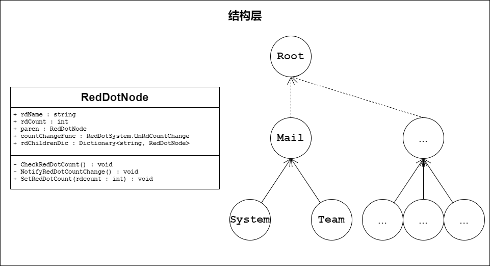
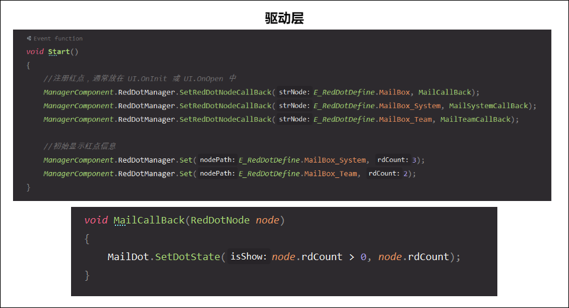
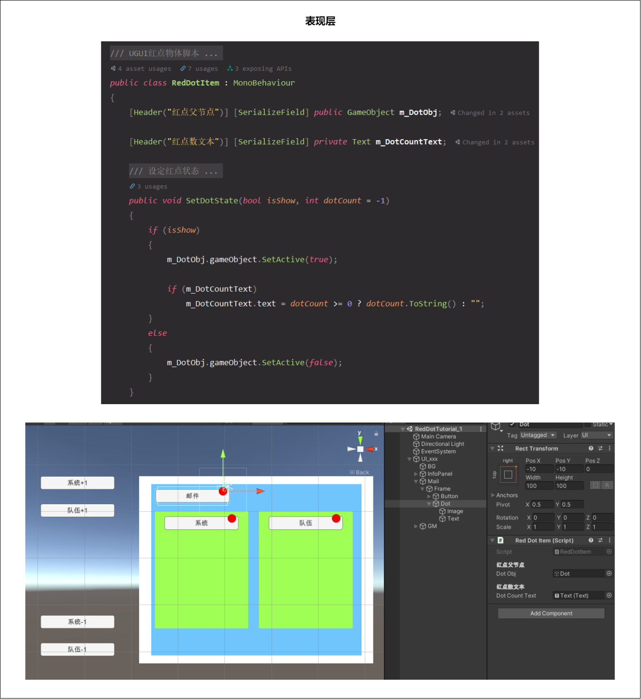

# 简述

基于 **树结构** 实现的简单红点管理器，采用Unity+C#实现

核心逻辑是从 [Unity手游实战：从0开始SLG——独立功能扩展（三）用树实现客户端红点系统](https://zhuanlan.zhihu.com/p/85978429) 搬的，此demo做了部分封装及备注说明，并详细梳理了设计思路（红点入坑√）

（其实目前网上大部分搜到的也是基于这篇，只不过除了作者外的文章都只是贴代码没说明...）


**项目地址：**[基于树结构实现的Unity红点管理器 - SouthBegonia](https://github.com/SouthBegonia/RedDotManager)

**项目结构：**

- *Assets/RedDotTutorial_1*    // demo路径
  - Prefabs	// 演示demo的预制体
  - Scenes 
    - RedDotTutorial_1.unity    // 演示demo的场景
  - Scripts
    - RedDotCore    // 红点系统核心脚本文件夹
    - ...    // 演示demo的临时业务脚本

# 设计思路

将红点管理器系统分为3层：**结构层、驱动层、表现层**

## 结构层

因为红点的特性（多层级、多深度），因此一种做法是采用 **树** 来构造：




核心是通过红点数据节点`RedDotNode`的 parent 和 rdChildrenDic 成员，实现树结构关联

> 备注：Mail节点指向Root节点采用虚线，是因为该例的所有红点的路径都是以Root为起点的（例如Root/Mail/System)，但在业务开发上，基本不涉及Root节点（初始化和红点路径校验时用得到），我们更关心的是第二层及其之后的节点

## 驱动层

即 **如何驱动这个树结构产生状态变化，以及状态变化之后如何将变化的行为通知到指定的表现层**，在一定的程度上将数据和表现分离开

该过程的简单理解：此红点信息变化->其RedDotNode信息变化->通知其订阅者->检查父红点RedDotNode信息变化->父红点信息变化->...




`SetRedDotNodeCallBack()` 和`Set()` 方法就不详细贴了，请查看项目源码

## 表现层

在收到红点变动的通知后，进行显示变化处理（红点样式、红点显隐、红点数、特效等），这层很独立，看各自业务需求了




# 用法示例

比如有个红点需求：主页内有个邮箱按钮（可显示红点），邮箱内又分为系统邮箱和队伍邮箱（都可以显示红点）

首先配置红点管理器`RedDotSystem`初始化的地方，正常业务应当放在游戏初始化入口内，本demo就用到再初始化：

```c#
public static class ManagerComponent
{
    /// <summary>
    /// 红点管理器
    /// </summary>
    private static RedDotSystem m_RedDotManager;
    public static RedDotSystem RedDotManager
    {
        get
        {
            //通常放在项目的初始化逻辑中，此处只是demo临时写法
            if (m_RedDotManager == null)
                m_RedDotManager = new RedDotSystem();
            return m_RedDotManager;
        }
    }
}
```

根据业务需求，添加3个红点路径到 `E_RedDotDefine` 和 `RedDotSystem.lstRedDotTreeList`：

```c#
/// <summary>
/// 红点路径定义
/// </summary>
public static class E_RedDotDefine
{
    /// <summary>
    /// 红点树的根节点
    /// </summary>
    public const string rdRoot = "Root";

    // ---------- 业务红点 ----------
    public const string MailBox = "Root/Mail";
    public const string MailBox_System = "Root/Mail/System";
    public const string MailBox_Team = "Root/Mail/Team";
}

/// <summary>
/// 红点系统
/// </summary>
public class RedDotSystem
{
    /// <summary>
    /// 红点路径的表（每次 E_RedDotDefine 添加完后此处也必须添加）
    /// </summary>
    private static List<string> lstRedDotTreeList = new List<string>
    {
        E_RedDotDefine.rdRoot,

        E_RedDotDefine.MailBox,
        E_RedDotDefine.MailBox_System,
        E_RedDotDefine.MailBox_Team,
    };
}
```

后就在业务逻辑内监听红点，本demo就用RedDotTutorial_1场景下的UI_xxx：

```c#
public class UI_xxx : MonoBehaviour
{
    public RedDotItem MailDot;

    void Start()
    {
        //注册监听红点，正常业务应当放在 UI.OnInit 或 UI.OnOpen 中。记得在UI.OnClose 或 UI.OnDestroy时监听置null
        ManagerComponent.RedDotManager.SetRedDotNodeCallBack(E_RedDotDefine.MailBox, MailCallBack);
        ManagerComponent.RedDotManager.SetRedDotNodeCallBack(E_RedDotDefine.MailBox_System, MailSystemCallBack);
        ManagerComponent.RedDotManager.SetRedDotNodeCallBack(E_RedDotDefine.MailBox_Team, MailTeamCallBack);
    }

    // 邮箱 红点数变化回调处理函数
    void MailCallBack(RedDotNode node)
    {
        MailDot.SetDotState(node.rdCount > 0, node.rdCount); //通知表现层
    }
}
```

最后就设定某红点数的变化了：

```c#
//邮箱->系统 的红点计数+1 按钮点击事件
public void OnAddRdSystemBtnClick()
{
    int count = ManagerComponent.RedDotManager.GetRedDotCount(E_RedDotDefine.MailBox_System);
    ManagerComponent.RedDotManager.Set(E_RedDotDefine.MailBox_System, count + 1);
}
```

**流程总结：**

1. 配置红点系统初始化入口

2. 添加红点路径信息

3. 业务模块监听红点变化 / 业务逻辑触发红点变化

# 优劣分析

- 优势：
  - 新加红点不会引入新脚本或配置文件，配置方法简单
  - 整体实现思路较为清晰简洁（结构层、驱动层、表现层）
- 劣势：
  - 性能问题（基于string的红点路径在各方法内会频繁执行`String.Split()`）
  - 该结构相当于单一树，在游戏初始化时刻即构造完毕，但要是遇到需要动态添加红点的需求呢？（再次重构红点树不大现实...）

# 参考文章

- [Unity手游实战：从0开始SLG——独立功能扩展（三）用树实现客户端红点系统](https://zhuanlan.zhihu.com/p/85978429)
