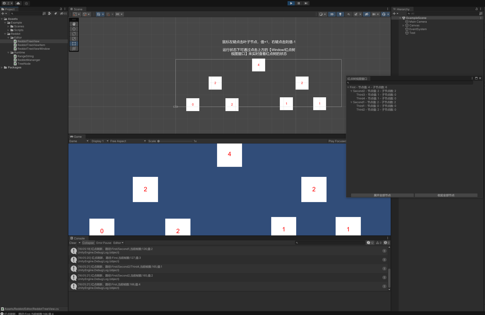

# RedDotManager

Unity中实现的各类红点管理器，暂分为C#实现和Lua实现

[TOC]

# C# 实现

## 基于树实现的简单红点系统

项目路径：此项目内的 *Assets/RedDotTutorial_1*

项目用法：运行 *Assets/RedDotTutorial_1/Scenes/RedDotTutorial_1* 场景即可查看

## 基于前缀树的红点系统 - HNGZ

项目地址：[基于前缀树的红点系统 - HNGZ](https://github.com/HNGZY/RedDotSystem)

优势：
- 前缀树的使用避免了频繁 `String.Split()` 
- 使用 **脏标记** 避免了同帧内的无效刷新
- 提供了 **红点树的可视化预览**

# Lua 实现

## RedPointSystem - NFalnaoky
项目地址：[RedPointSystem - NFalnaoky](https://github.com/NFalnaoky/RedPointSystem)
