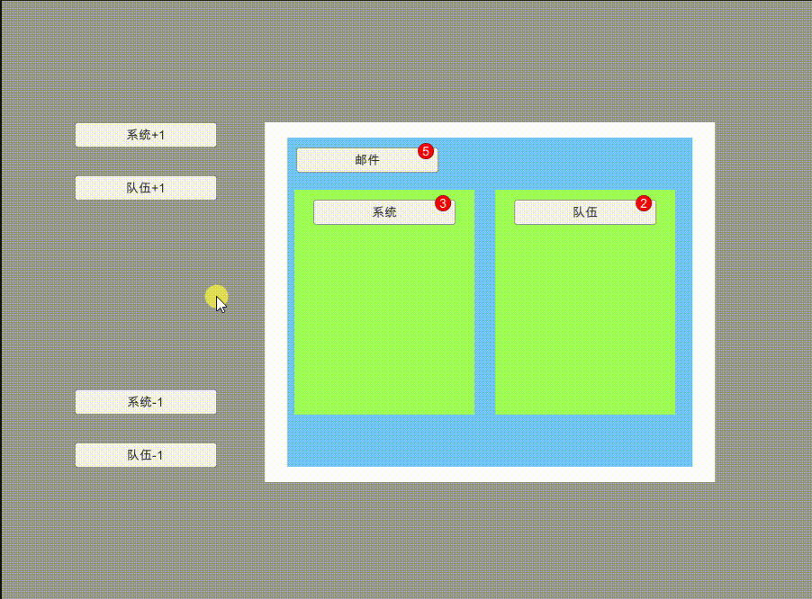

# RedDotManager
Unity中实现的各类红点管理器，暂分为C#实现和Lua实现

# C# 实现

## 版本A

### 简述

> 核心是从 [Unity手游实战：从0开始SLG——独立功能扩展（三）用树实现客户端红点系统](https://zhuanlan.zhihu.com/p/85978429) 搬的，此处做了部分封装及备注说明，最后可以直接导包到其他项目使用

项目地址：*Assets/RedDotTutorial_1*

项目用法：运行 *Assets/RedDotTutorial_1/Scenes/RedDotTutorial_1* 场景即可查看

### 设计思路及代码实现

### 优劣分析

- 优势：
  - AAA
  - BBB
- 劣势：
  - AAA
  - BBB

### 参考

- [Unity手游实战：从0开始SLG——独立功能扩展（三）用树实现客户端红点系统](https://zhuanlan.zhihu.com/p/85978429)
